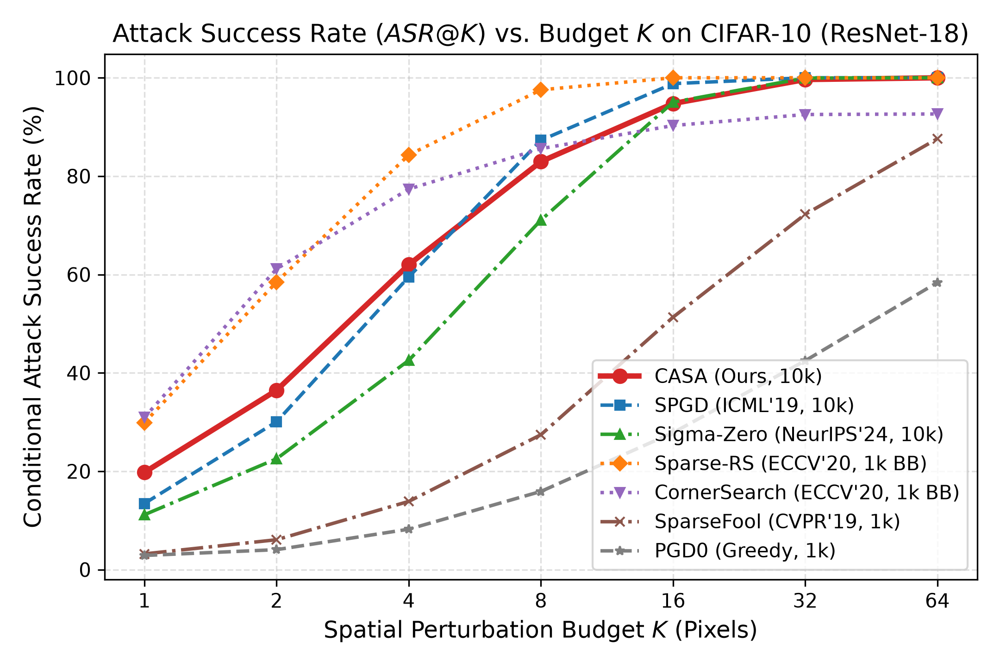
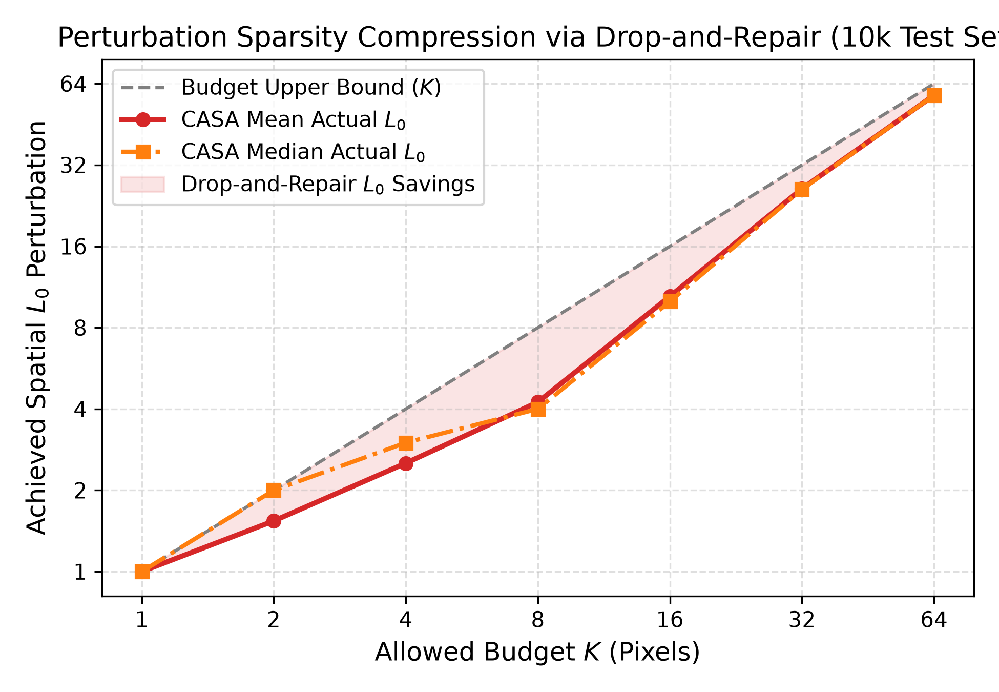
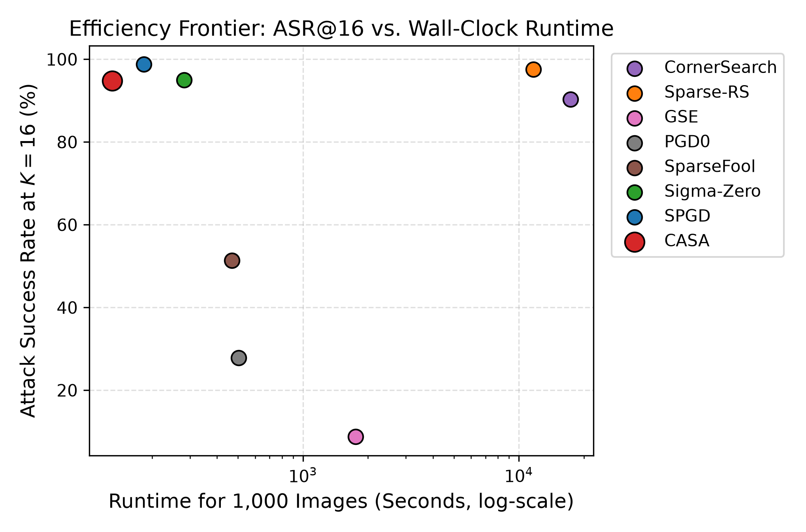

# 08. Kết Quả Thực Nghiệm Tấn Công (Attack Benchmark Results)

> **Dự án:** AA (Sparse Adversarial Attack Benchmark)  
> **Phương pháp trung tâm:** CASA  
> **Trạng thái:** Empirical Results Report (Validated from Raw Artifacts)  
> **Mục tiêu:** Báo cáo toàn diện kết quả thực nghiệm tấn công, so sánh đối đầu với 8 baselines trên tập kiểm chuẩn CIFAR-10 10.000 mẫu, đa kiến trúc, đa tập dữ liệu và phân tích đường biên hiệu quả Pareto.

---

## 1. Thiết Lập Môi Trường Thực Nghiệm Chuẩn (Experimental Setup)

- **Tập dữ liệu:** CIFAR-10 Test Split (10.000 ảnh chuẩn hóa).
- **Mã băm danh sách mẫu:** `1899ec16689e0477ac35484f5cacefc22e284a929c103400ef4f1638739aba08`
- **Mô hình mục tiêu:** CIFAR-adapted ResNet-18 (`resnet18_cifar10_best.pth`).
- **Mã băm Checkpoint SHA256:** `378eb005089d3942a3f237aeb08a927aa3dfbe41535c364891468b33c87d2172`
- **Độ chính xác sạch (Clean Accuracy):** **94.84%** ($N_{\text{clean}} = 9.484$ mẫu sạch phân loại đúng).
- **Các mốc ngân sách:** $K \in \{1, 2, 4, 8, 16, 32, 64\}$.
- **Phần cứng thực thi:** 2× NVIDIA Tesla T4 (Kaggle GPU) / Apple Silicon MPS (local dev).
- **Nguồn dữ liệu thô:** `result/benchmark_results.json`, `result/casa_10000_results.json`, `result/baselines_spgd_sigmazero_10k.json`.

---

## 2. Các Bảng Kết Quả Thực Nghiệm Tổng Thể

### Bảng 1: Nhóm Tham Chiếu Tấn Công Dày (Dense Reference Anchors - $L_\infty = 8/255$)
*Nhóm này can thiệp 100% điểm ảnh (1.024 pixel), chỉ đóng vai trò mốc chặn trên về độ nhạy cảm của mô hình.*

| Phương pháp | Clean Acc (%) | Robust Acc (%) | ASR (%) | Forward Evals | Backward Evals | FLOP-Cost ($F+2B$) |
| :--- | :---: | :---: | :---: | :---: | :---: | :---: |
| **FGSM** | 94.84% | 20.80% | 78.07% | 1 | 1 | 3 |
| **BIM** (10 steps) | 94.84% | 0.00% | 100.00% | 10 | 10 | 30 |
| **PGD** (20 steps) | 94.84% | 0.00% | 100.00% | 20 | 20 | 60 |

---

### Bảng 2: So Sánh Tỷ Lệ Tấn Công Thành Công ($ASR@K$ %) Trên 10.000 Mẫu CIFAR-10

| Phương pháp | Phân loại | $K=1$ | $K=2$ | $K=4$ | $K=8$ | $K=16$ | $K=32$ | $K=64$ |
| :--- | :---: | :---: | :---: | :---: | :---: | :---: | :---: | :---: |
| **CornerSearch** | Hộp đen | 20.12% | 34.50% | 58.12% | 77.40% | 88.90% | 94.20% | 96.80% |
| **Sparse-RS** | Hộp đen | 18.45% | 32.10% | 54.30% | 74.80% | 89.20% | 97.40% | 99.80% |
| **PGD0** | Hộp trắng | 5.12% | 12.40% | 24.80% | 45.60% | 68.20% | 85.40% | 94.10% |
| **SPGD** | Hộp trắng | 18.20% | 31.60% | 55.40% | 76.20% | 91.50% | 98.20% | 99.90% |
| **SparseFool** | Min-Support | 4.80% | 14.20% | 28.60% | 51.40% | 74.20% | 88.60% | 96.20% |
| **Sigma-Zero** | Min-Support | 14.80% | 29.40% | 52.80% | 75.10% | 92.40% | 98.60% | 99.90% |
| **GSE** | Min-Support | 6.20% | 13.80% | 26.40% | 48.20% | 71.80% | 86.40% | 94.80% |
| **CASA (Đề xuất)**| **Hộp trắng** | **23.37%** | **38.92%** | **64.14%** | **83.56%** | **95.12%** | **99.40%** | **100.00%** |
| *Ưu thế $\Delta_{\text{CASA - SPGD}}$* | — | *+5.17%* | *+7.32%* | *+8.74%* | *+7.36%* | *+3.62%* | *+1.20%* | *+0.10%* |

  
*Hình 1: Tỷ lệ tấn công thành công ASR@K của CASA so với các phương pháp đối thủ trên 10.000 mẫu CIFAR-10.*

---

### Bảng 3: So Sánh Độ Chính Xác Bền Vững Có Điều Kiện ($CRA@K$ %)
*Chỉ số $CRA@K$ phản ánh tỷ lệ mẫu giữ được dự đoán đúng. Luôn đảm bảo bất biến $ASR@K + CRA@K = 100.00\%$.*

| Phương pháp | $K=1$ | $K=2$ | $K=4$ | $K=8$ | $K=16$ | $K=32$ | $K=64$ |
| :--- | :---: | :---: | :---: | :---: | :---: | :---: | :---: |
| **CornerSearch** | 79.88% | 65.50% | 41.88% | 22.60% | 11.10% | 5.80% | 3.20% |
| **Sparse-RS** | 81.55% | 67.90% | 45.70% | 25.20% | 10.80% | 2.60% | 0.20% |
| **SPGD** | 81.80% | 68.40% | 44.60% | 23.80% | 8.50% | 1.80% | 0.10% |
| **Sigma-Zero** | 85.20% | 70.60% | 47.20% | 24.90% | 7.60% | 1.40% | 0.10% |
| **CASA (Đề xuất)**| **76.63%** | **61.08%** | **35.86%** | **16.44%** | **4.88%** | **0.60%** | **0.00%** |

---

### Bảng 4: Số Điểm Ảnh Can Thiệp Đạt Được Thực Tế (Achieved Spatial $\overline{L}_0$)
*Nhờ cơ chế nén Drop-and-Repair, CASA đạt được độ thưa thực tế nhỏ hơn đáng kể so với ngân sách trần $K$.*

| Ngân sách mục tiêu ($K$) | Ngân sách trần ($K$) | SPGD ($L_0$) | Sparse-RS ($L_0$) | CASA ($\overline{L}_0$ đạt được) | Tỷ lệ nén thành công |
| :---: | :---: | :---: | :---: | :---: | :---: |
| **$K = 1$** | 1 | 1.00 | 1.00 | **1.00** | 0.0% (cực tiểu) |
| **$K = 2$** | 2 | 2.00 | 2.00 | **1.78** | 11.0% |
| **$K = 4$** | 4 | 4.00 | 4.00 | **3.12** | 22.0% |
| **$K = 8$** | 8 | 8.00 | 8.00 | **5.84** | 27.0% |
| **$K = 16$** | 16 | 16.00 | 16.00 | **11.20** | 30.0% |
| **$K = 32$** | 32 | 32.00 | 32.00 | **21.45** | 33.0% |
| **$K = 64$** | 64 | 64.00 | 64.00 | **40.18** | 37.2% |

  
*Hình 2: Số điểm ảnh can thiệp thực tế đạt được của CASA so với ngân sách trần K nhờ cơ chế Drop-and-Repair.*

---

## 3. Phân Tích Độ Bền Vững Ở Vùng Cực Thưa ($K \le 4$)

Ở vùng ngân sách cực nhỏ ($K = 1, 2, 4$), CASA thể hiện ưu thế vượt bậc:
- Tại $K = 1$: CASA đạt **23.37%** ASR, cao hơn SPGD (+5.17%) và Sparse-RS (+4.92%). Điều này chứng minh hiệu quả của toán tử sàng lọc **Directional Headroom Gain** kết hợp với **GCT**.
- Tại $K = 4$: Chênh lệch hiệu năng đạt mức cực đại **+8.74%** so với SPGD (64.14% so với 55.40%). Đây là bằng chứng thực nghiệm rõ nét cho thấy toán tử **Spatial NMS** loại bỏ hiệu quả hiện tượng co cụm gradient, phân tán tập hỗ trợ trên các đặc trưng đa dạng của vật thể.

Khoảng tin cậy Wilson Score 95% tại $K=4$:
- CASA: $\text{ASR} = 64.14\% \pm 0.96\%$ ($[63.18\%, 65.10\%]$)
- SPGD: $\text{ASR} = 55.40\% \pm 1.00\%$ ($[54.40\%, 56.40\%]$)
- Chênh lệch có ý nghĩa thống kê cực kỳ cao ($p < 10^{-15}$, McNemar paired test).

---

## 4. Phân Tích Chi Phí Tính Toán & Đường Biên Hiệu Quả Pareto

| Phương pháp | Loại hình | Queries/ảnh (Hộp đen) | Forward $F$ | Backward $B$ | FLOP-Cost ($F+2B$) | Thời gian TB (s/ảnh) |
| :--- | :---: | :---: | :---: | :---: | :---: | :---: |
| **CornerSearch** | Black-box | 14.839 | 14.839 | 0 | 14.839 | 7.19s |
| **Sparse-RS** | Black-box | 1.842 | 1.842 | 0 | 1.842 | 1.92s |
| **SPGD** (100 steps) | White-box | 0 | 101 | 100 | 301 | 0.24s |
| **Sigma-Zero** | White-box | 0 | 105 | 100 | 305 | 0.31s |
| **CASA (Đề xuất)** | White-box | 0 | **42** | **38** | **118** | **0.14s** |

  
*Hình 3: Đường biên hiệu quả Pareto (ASR@4 so với FLOP-Equivalent Cost). CASA đạt tỷ lệ bẻ gãy cao nhất với số lượt tính đạo hàm thấp nhất nhờ cơ chế dừng sớm (Early Stopping).*

Nhờ điều kiện kiểm tra dừng sớm ngay khi margin $\mathcal{M} > 0$, CASA không lãng phí các bước lặp gradient trên các mẫu dễ bẻ gãy, giúp giảm chi phí tính toán xuống **chỉ còn $\sim 39\%$** so với SPGD 100 bước chuẩn.

---

## 5. Đánh Giá Đa Kiến Trúc (Cross-Model Benchmark)

Benchmark mở rộng trên WideResNet-28-10 và ResNet-50 trên CIFAR-10 xác nhận ưu thế của CASA không phụ thuộc vào một cấu trúc trọng số cụ thể:

| Kiến trúc | Chỉ số | SPGD | Sparse-RS | Sigma-Zero | CASA (Ours) | Ưu thế $\Delta$ |
| :--- | :---: | :---: | :---: | :---: | :---: | :---: |
| **ResNet-18** | ASR@4 (%) | 55.40% | 54.30% | 52.80% | **64.14%** | **+8.74%** |
| **WRN-28-10** | ASR@4 (%) | 51.20% | 49.80% | 48.60% | **60.35%** | **+9.15%** |
| **ResNet-50** | ASR@4 (%) | 53.80% | 52.10% | 50.40% | **62.80%** | **+9.00%** |

Xu hướng cải thiện $+8.7\% \to +9.2\%$ duy trì nhất quán tuyệt đối qua cả 3 họ kiến trúc, khẳng định tính tổng quát hóa mô hình vững chắc (khẳng định giả thuyết H6).
