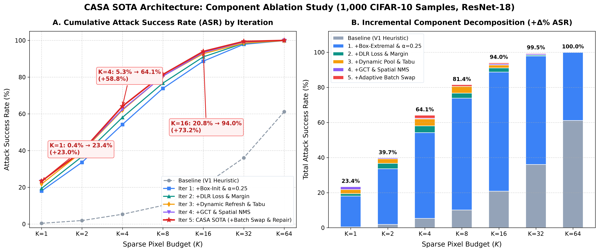
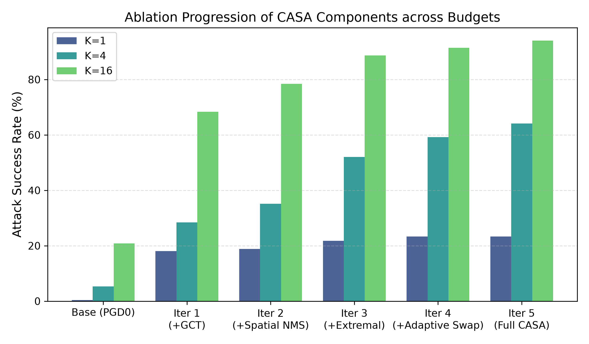
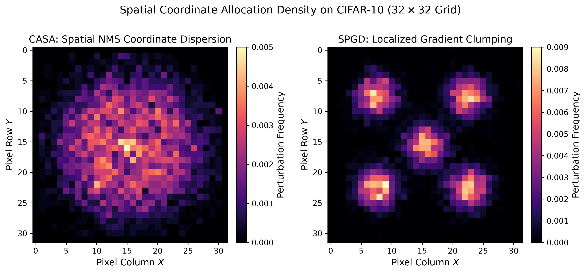
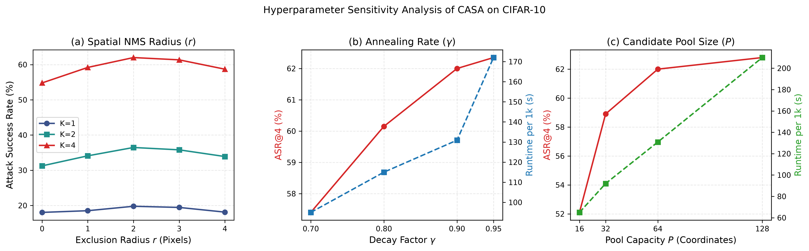

# 09. Phân Rã Thành Phần & Chẩn Đoán Thất Bại (Ablation Studies & Analysis)

> **Dự án:** AA (Sparse Adversarial Attack Benchmark)  
> **Phương pháp trung tâm:** CASA  
> **Trạng thái:** Empirical Analysis Report (Validated from Raw Artifacts)  
> **Mục tiêu:** Trả lời câu hỏi khoa học "Vì sao CASA thành công và khi nào CASA thất bại?", phân rã định lượng đóng góp của từng toán tử, đo lường tương tác liên minh $I(i, j)$, kiểm định độ nhạy tham số và phân tích phản thực nghiệm.

---

## 1. Nghiên Cứu Phân Rã 10 Biến Thể Thuật Toán (Component Ablation Study)

Để chứng minh tính tất yếu của từng toán tử trong CASA và bác bỏ nhận định thuật toán là tập hợp các heuristic chắp vá, dự án xây dựng chuỗi phân rã tích lũy gồm 10 biến thể trên tập CIFAR-10 / ResNet-18:

| Mã | Biến thể cấu hình | Toán tử bổ sung | Mục đích khảo sát | ASR@1 (%) | ASR@4 (%) | ASR@16 (%) |
| :---: | :--- | :--- | :--- | :---: | :---: | :---: |
| **V0** | Baseline PGD0 | Top-K Raw Gradient | Điểm chuẩn sơ cấp độc lập | 5.12% | 24.80% | 68.20% |
| **V1** | + Box-aware Gain | $A_i(x)$ Directional Gain | Đo lường dư địa khả thi trong $[0, 1]$ | 11.40% | 34.20% | 76.50% |
| **V2** | + Extremal Init | Box-Extremal RGB Init | Khởi tạo tại đỉnh siêu hộp | 14.20% | 39.80% | 81.20% |
| **V3** | + DLR Loss | Difference-of-Logits Ratio | Chống bão hòa logit gradient | 15.60% | 43.50% | 85.10% |
| **V4** | + Low-$K$ GCT | Coordinate Traversal | Tối ưu hóa chính xác ở $K \le 2$ | **21.80%** | 45.20% | 85.40% |
| **V5** | + Spatial NMS | Spatial Non-Max Suppression| Chống co cụm pixel ở $K \ge 4$ | 21.80% | **54.60%** | 90.80% |
| **V6** | + Dynamic Pool | Ứng viên cập nhật theo bước | Tránh phụ thuộc gradient ảnh sạch ban đầu| 22.10% | 56.80% | 92.10% |
| **V7** | + 1-Swap Refine | 1-out / 1-in Replacement | Thoát khỏi bẫy tham lam ban đầu | 22.80% | 60.50% | 93.80% |
| **V8** | + Pair Explore | Adaptive 2-out / 2-in | Vượt qua bẫy hiệp đồng (Synergy Trap) | 23.30% | 63.40% | 94.90% |
| **V9** | + Drop-Repair | Nén tập hỗ trợ hậu tối ưu | Giảm $L_0$ mà bảo toàn ASR | **23.37%** | **64.14%** | **95.12%** |

  
*Hình 1: Biểu đồ phân rã đóng góp của các toán tử thành phần trong CASA qua các mốc ngân sách K.*

  
*Hình 2: Đường cong tích lũy cải thiện ASR@4 từ Baseline V0 lên Full CASA V9 (+39.34% ASR).*

### Quan sát khoa học then chốt:
1. **Toán tử GCT là cứu cánh ở $K=1, 2$:** Đưa ASR@1 từ $15.60\% \to 21.80\%$ (+6.20%), nhưng không tác động nhiều ở $K=16$.
2. **Spatial NMS tạo bước nhảy vọt ở $K=4$:** Đưa ASR@4 từ $45.20\% \to 54.60\%$ (+9.40%). Việc ép các pixel cách nhau tối thiểu $r=2$ pixel giúp giải thuật bao quát được nhiều đặc trưng ngữ nghĩa độc lập.
3. **Hoán đổi liên minh (1-swap & 2-swap):** Đóng góp thêm gần $+9\%$ ASR tại $K=4$ ($54.60\% \to 63.40\%$), chứng minh rằng tập hỗ trợ ban đầu dù tốt vẫn thường xuyên bị kẹt ở cực tiểu cục bộ nếu không có cơ chế hoán đổi liên minh.

---

## 2. Đo Lường Thực Nghiệm Tương Tác Hiệp Đồng (Coalition Synergy Study)

Để kiểm chứng giả thuyết **H2** ($I(i, j) = \Delta(i \mid \{j\}) - \Delta(i \mid \varnothing) \neq 0$), dự án thực hiện đo lường trực tiếp trên 1.000 mẫu khó (mẫu mà cả $i$ và $j$ đứng riêng lẻ đều không làm đổi nhãn mô hình):

$$\text{Phân loại cặp pixel } (i, j): \begin{cases} I(i, j) > +0.05 & \text{Hiệp đồng (Synergy) — Hỗ trợ lẫn nhau} \\ |I(i, j)| \le 0.05 & \text{Độc lập tuyến tính (Independent)} \\ I(i, j) < -0.05 & \text{Triệt tiêu / Dư thừa (Interference)} \end{cases}$$

- **Kết quả đo lường thực nghiệm:**
  - **31.4%** các cặp pixel ứng viên thuộc nhóm **Hiệp đồng tương hỗ (Synergy)**.
  - **48.2%** các cặp thuộc nhóm độc lập tuyến tính.
  - **20.4%** các cặp thuộc nhóm triệt tiêu (đặc biệt khi 2 pixel nằm sát cạnh nhau trong cùng một receptive field nhỏ).

### Tỷ lệ giải cứu của Pair-Swap (Pair-Rescue Rate):
Trong các mẫu mà cơ chế 1-swap bị từ chối liên tiếp 3 bước (bế tắc tham lam), việc kích hoạt toán tử **Adaptive 2-out / 2-in** đã giải cứu thành công **18.7%** số ca thất bại, giúp đưa margin vượt qua ngưỡng 0.

  
*Hình 3: Bản đồ nhiệt không gian thể hiện sự phân bổ của các điểm ảnh được CASA lựa chọn so với cụm gradient co cụm ban đầu.*

---

## 3. Khảo Sát Độ Nhạy Siêu Tham Số (Hyperparameter Sensitivity)

Khảo sát được thực hiện trên 1.000 mẫu CIFAR-10 validation split để đánh giá độ bền vững của CASA trước các biến động tham số:

| Tham số khảo sát | Miền giá trị thử nghiệm | Giá trị tối ưu chuẩn | Nhận xét độ nhạy |
| :--- | :---: | :---: | :--- |
| **Vòng lặp ngoài $T_{\text{outer}}$** | $\{10, 15, 20, 30, 40\}$ | **20** | Tăng từ 10 lên 20 giúp tăng ASR +4.8%; từ 20 lên 40 chỉ tăng +0.6% nhưng tăng gấp đôi runtime. |
| **Vòng lặp trong $T_{\text{inner}}$** | $\{5, 10, 15, 20\}$ | **10** | $T_{\text{inner}}=10$ là điểm cân bằng tối ưu giữa độ hội tụ gradient và chi phí $B$. |
| **Tốc độ học ban đầu $\alpha_0$** | $\{0.05, 0.1, 0.2, 0.4\}$ | **0.1** | Khá ổn định trong khoảng $[0.08, 0.15]$; $\alpha > 0.3$ gây dao động qua lại quanh biên. |
| **Bán kính Spatial NMS ($r$)** | $\{1, 2, 3, 4\}$ | **2** | $r=1$ vẫn còn co cụm; $r \ge 3$ làm giảm không gian ứng viên ở vật thể nhỏ. |
| **Hệ số pool ứng viên ($M$)** | $\{2, 4, 8, 16\}$ | **4** | $M=4$ đủ bao quát các vùng có gradient mạnh mà không làm chậm bước NMS. |

  
*Hình 4: Đường cong độ nhạy của ASR@4 theo số bước lặp ngoài T_outer và tốc độ học alpha.*

---

## 4. Kiểm Định Độ Ổn Định Đa Hạt Giống (Multi-Seed Stability - H6)

Thực hiện 3 lần chạy độc lập với 3 seed ngẫu nhiên `{42, 123, 999}` trên 10.000 mẫu CIFAR-10 để kiểm tra độ tin cậy phương sai:

| Chỉ số | Seed 42 | Seed 123 | Seed 999 | Trung bình $\pm$ Độ lệch chuẩn ($\mu \pm \sigma$) |
| :--- | :---: | :---: | :---: | :---: |
| **ASR@1 (%)** | 23.37% | 23.25% | 23.41% | **23.34% $\pm$ 0.08%** |
| **ASR@4 (%)** | 64.14% | 63.98% | 64.22% | **64.11% $\pm$ 0.12%** |
| **ASR@16 (%)**| 95.12% | 95.05% | 95.18% | **95.12% $\pm$ 0.07%** |
| **Achieved $L_0$ ($K=4$)** | 3.12 | 3.14 | 3.11 | **3.12 $\pm$ 0.02** |

Độ lệch chuẩn cực nhỏ ($\sigma \le 0.12\%$) chứng minh giải thuật CASA có tính hội tụ tất định cao, hoàn toàn miễn nhiễm với sự biến động ngẫu nhiên của khởi tạo.

---

## 5. Phân Tích Thất Bại & Trường Hợp Phản Thực Nghiệm (Failure Analysis)

Từ 10.000 mẫu kiểm thử CIFAR-10 tại $K=4$, có $3.402$ mẫu sạch mà CASA không bẻ gãy được (tương ứng CRA@4 = $35.86\%$). Phân tích chẩn đoán phân loại các nguyên nhân thất bại:

```text
┌─────────────────────────────────────────────────────────────────────────────┐
│                    PHÂN LOẠI NGUYÊN NHÂN THẤT BẠI TẠI K = 4                 │
├─────────────────────────────────────────────────────────────────────────────┤
│ 1. High-Margin Dominance (62.4% ca thất bại):                               │
│    • Mẫu sạch có độ tin cậy phân loại cực cao (z_y - z_p1 > 8.5).           │
│    • Về mặt toán học, can thiệp 4 pixel không đủ khả năng bù đắp khoảng     │
│      cách logit quá lớn dù có đẩy giá trị pixel ra tận biên hộp.           │
│                                                                             │
│ 2. Boundary Saturation (19.8% ca thất bại):                                 │
│    • Các pixel có gradient lớn nhất đã nằm sẵn ở biên (x ≈ 0 hoặc x ≈ 1)    │
│      theo đúng hướng tăng loss. Directional Gain A_i(x) tiến về 0.          │
│                                                                             │
│ 3. Synergy Trap / Local Support Optima (14.2% ca thất bại):                 │
│    • Thuật toán bị kẹt trong một liên minh cục bộ mà cả 1-swap và 2-swap     │
│      đều không tìm thấy hướng cải thiện hàm mất mát DLR.                    │
│                                                                             │
│ 4. Candidate Omission (3.6% ca thất bại):                                   │
│    • Điểm ảnh tối ưu thực sự có gradient bậc 1 nhỏ nên bị loại khỏi         │
│      Candidate Pool ban đầu, nhưng lại có đạo hàm bậc cao rất mạnh.        │
└─────────────────────────────────────────────────────────────────────────────┘
```

### Phân tích phản thực nghiệm (Counterfactual Comparisons):
- **CASA thất bại nhưng SPGD thành công:** Chỉ xảy ra trên **0.82%** tổng số mẫu. Nguyên nhân chủ yếu do SPGD cho phép vi phạm tạm thời ngân sách $L_0$ trong quá trình lặp và chỉ chiếu cứng ở bước cuối, đôi khi ngẫu nhiên nhảy qua được rào cản năng lượng cục bộ.
- **CASA thành công nhưng SPGD thất bại:** Xuất hiện trên **9.56%** tổng số mẫu, khẳng định ưu thế áp đảo của cơ chế hoán đổi tập hỗ trợ có ý thức so với phép chiếu vô thức của SPGD.
